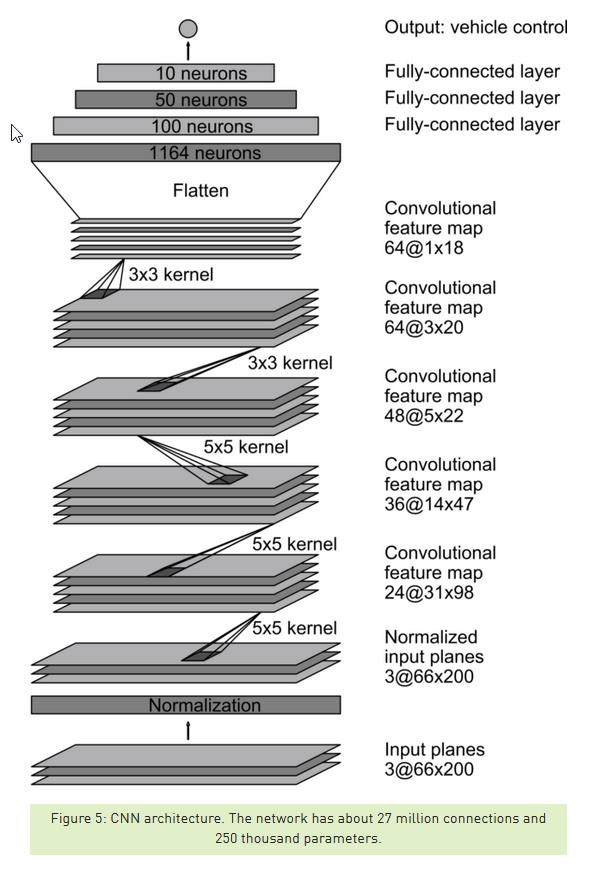

# Behavioral cloning
Self Driving car Nano Degree project to Behaviour clone a car steering in a simulator using Python, CNN, keras.  

Images are obtained from simulator along with the stearing angle of the car at each point on the road in simulator. These image along with stearing angle are used to train the model. The tained model is interfaced with simulatore which drove the car autonomously.

## Model Architecture, Training Strategy & Documentation:

### Has an appropriate model architecture been employed for the task?

Two models are trained with available data. First model is “LeNet5”, used in traffic signal classification problem in previous project, is used for training with modification so that last layer 1 neuron for Steering angle instead of 43 neurons which was to classify 43 different traffic signals. With this model after training, car in Autonomous mode is not driving properly it went off the road and got drowned in water.

Second model is the model from NVIDIA as shown above is implemented. This model gave a very good result and the car can able to complete two laps, the details on training strategy, data selection is discussed in upcoming chapters. This model has 5 convolution layer followed by 3 layer of Fully-connected layer and the final layer is the output layer of single neuron which predicts driving angle.

`Normalized input image - 160x320x3`  
`Cropping2D – 65x320x3`  
`Conv2D(24, (5x5),strids=(2x2)) – 31x158x24`  
`Conv2D(36, (5x5),strids=(2x2)) – 14x77x36`  
`Conv2D(48, (5x5),strids=(2x2)) – 5x37x48`  
`Conv2D(64, (3x3),strids=(1x1)) – 3x35x64`  
`Conv2D(64, (3x3),strids=(1x1)) – 1x33x64`  
`Flatten – 2112`  
`FullyConnected – 100`  
`FullyConnected – 50`  
`FullyConnected – 10`  
`Output - 1`  

Data is normalized using Lambda layer from keras, as max pixel values in RGB layers is 255, dividing each pixel by 255 can lead to a value between (0,1) and subtracting by 0.5 leads to a value between (-0.5,0.5) for each pixel.  
`model.add(Lambda(lambda x: x/255.0 - 0.5))`

Non-Linearity in the model is achieved by using “relu” activation.  
`model.add(Conv2D(24, (5, 5), activation="relu", strides=(2, 2)))`

### Has an attempt been made to reduce overfitting of the model?

The complete data available for training is shuffled and 10% of data is used for validation. Overfitting of the model is taken care by “Early termination” approach. During training epochs was started at 10 and could clearly see validation loss increases from epoch=3 onwards and early termination was applied and stopped training at epoch=2  
`model.fit(X_train, y_train, validation_split=0.1, shuffle=True, epochs=2)`  

### Have the model parameters been tuned appropriately?

Optimizer is used to reduce the training loss. “Adam” optimizer for first-order gradient-based optimization of stochastic objective functions, based on adaptive estimates of lower-order moments. The method is straightforward to implement, is computationally efficient, has little memory requirements, and is well suited for problems that are large in terms of data and/or parameters. The method is also appropriate for non-stationary objectives and problems with very noisy and/or sparse gradients. The hyper-parameters have intuitive interpretations and typically require little tuning.  
`model.compile(loss='mse', optimizer='adam')`

By directly calling the optimizer default hyperparameter values are used.  
`keras.optimizers.Adam(learning_rate=0.001, beta_1=0.9, beta_2=0.999, amsgrad=False)`

“Mean Square error” is considered in this model to calculate the loss, on which the optimizer will work on to reduce the loss.

### Is the training data chosen appropriately?

Training with data from Udacity: At first only data from front camera considered for training, car while driving autonomously went off-road at the first gradual left turn as car didn’t steer left. Then images from all three camera is considered for training, car could drive autonomously for 15-20% of the track.
Then I collected new data from simulator with following strategy.

i. Drove car in actual path for two laps  
ii. Drove car in reverse path for one lap  
iii. At different points on the track, stopped car to left/right side of track and recorded images when driving to the center.  

Model trained with raw images of size 160x320 is not working fine and it can be cropped with below function.  
`model.add(Cropping2D(cropping=((70,25), (0,0))))`

Here Bridge on the track is cropped over height.  
  
Normal road is cropped.  

## Single lap of car around the circuit

